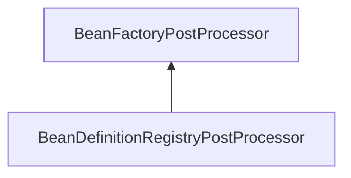
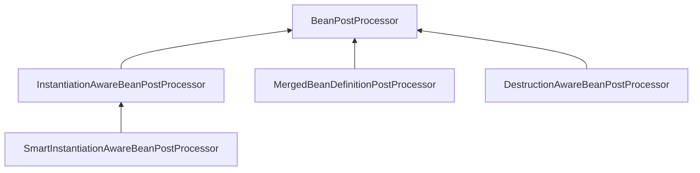

`Spring` 框架提供了几种 `PostProcessor` 接口用于建模对容器或者`bean`的后置处理器，它们定义了一些方法，这些方法在特定的时机会被调用。通过这种机制，框架自身或者应用开发人员有机会在不侵入容器或者`bean`核心逻辑的情况下为容器或者`bean`做针对某些特定方面的定制或者扩展：能力增强，属性设置，内容修改，对象代理，甚至直接替换整个`bean`。

<!--more-->

`Spring` 提供的 `PostProcessor` 接口有如下几种 ：

- `BeanDefinitionRegistryPostProcessor` – `BeanDefinitionRegistry` 后置处理器 – 容器级别

- `BeanFactoryPostProcessor` – `BeanFactory` 后置处理器 – 容器级别

- `BeanPostProcessor` – `Bean` 后置处理器 – bean实例级别

实际应用中又可细分为如下几类 :

1. InstantiationAwareBeanPostProcessor

2. MergedBeanDefinitionPostProcessor

3. DestructionAwareBeanPostProcessor

4. SmartInstantiationAwareBeanPostProcessor

5. 一般BeanPostProcessor

`Spring` 框架自身提供了很多这些 `PostProcessor` 的实现类，每个 `PostProcessor` 实现类分别有不同的关注点，`Spring` 利用这些 `PostProcessor` 实现类完成了很多框架自身的任务，主要在容器启动和 `bean` 获取阶段。另外，开发人员也可以实现自己的 `PostProcessor` 来扩展 `Spring` 容器或者 `bean` 的能力。这里面尤其是通过自定义实现 `BeanPostProcessor` , 开发人员有机会对容器中所有的 `bean` 做定制。

> 注意，本文中 PostProcessor 只是用于表达"后置处理器"这一概念，而并非 Spring 中存在一个使用此名字的接口或者类。

以上各种容器级别 `PostProcessor` 接口之间的继承关系:

以上各种 `bean` 级别 `BeanPostProcessor` 接口之间的继承关系:

**参考文章**

[Spring各种PostProcessor : BeanDefinitionRegistryPostProcessor](https://blog.csdn.net/andy_zhang2007/article/details/86318719)

[Spring各种PostProcessor : BeanFactoryPostProcessor](https://blog.csdn.net/andy_zhang2007/article/details/86318691)

[Spring各种PostProcessor : BeanPostProcessor](https://blog.csdn.net/andy_zhang2007/article/details/86318633)

[Springboot 应用常见的BeanPostProcessor清单](https://blog.csdn.net/andy_zhang2007/article/details/86105378)

[Spring-单例bean创建过程小结](https://blog.csdn.net/andy_zhang2007/article/details/86499574)

原文：[Spring的各种PostProcessor](https://blog.csdn.net/andy_zhang2007/article/details/78595558)
